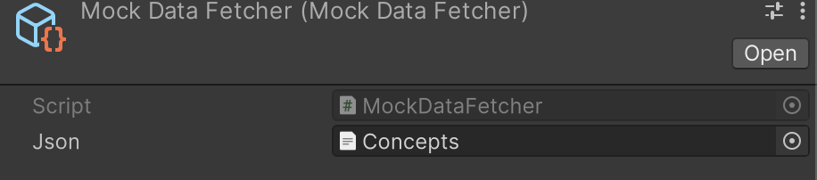

# Context
Project created as part of a job interview.  
An instruction was to develop a solution in the "YourWork" folder only.  
Project completed in the equivalent of one day of work spread over less than a week.  
Although it could definitely be refined, I'm satisfied with the time invested/results achieved ratio.

# Summary
Visualization of learning through Jenga towers

The idea behind the project was to represent learning through Jenga towers, to show that solid learning rests on solid foundations.
- The tower represents a coherent set of knowledge, for example a subject or a specific domain (e.g., Mathematics Grade 2).
- Each block corresponds to an elementary concept: an essential building block of knowledge.
- The set of towers reflects a complete curriculum or educational path.


## Block Types
Each block has an associated material to represent the state of knowledge:
- **Glass**: Knowledge not acquired — fragile, disappears under gravity.
- **Wood**: Knowledge in the process of being acquired — still unstable but existing.
- **Stone**: Knowledge solidly acquired — reliable foundation.

The system is designed to evolve: other block types and properties can be added in the future.

## Functioning
When a tower is subjected to "gravity":
- Glass blocks disappear.
- The state of the tower shows whether learning holds or collapses.


## Objective
- At the tower level: visualize the state of knowledge in a given domain.
- At the multiple towers level: obtain an overview of knowledge and identify gaps.

Each block is associated with a specific concept, which can be displayed by hovering over the block in question.

# Technical Details

## Project Structure
```
/Assets/YourWork/
  ├── Jenga/         # Game logic and blocks
  ├── GameModes/     # Game modes and menus
  ├── DataFetcher/   # Data management
```

The project is organized into three main sections:
- A section for generating towers and the laws they follow
- A section for game modes, menus, and controls
- A section for data management

## Common
The exercise did not require differentiating between Stone and Wood blocks, but suggested they might eventually have different properties:
- The code allows for easy creation of new block types
- Each block has its own properties

## Data System
An API call allows retrieving a program to form a set of towers.  
The system is designed to be easily connectable to an educational API.

We inject an `IDataFetcher` to retrieve data. We can choose to inject the `DataFetcher` or the `MockDataFetcher` to test with local JSON files. Both are ScriptableObjects where we can configure our API settings, and we can have multiple ones for different tests.




Basic but clean injection management, we can easily choose the nature of the DataFetcher used and the endpoints it uses.

# Controls
- **Up Arrow**: Move Up
- **Down Arrow**: Move Down
- **Left Arrow**: Rotate Left
- **Right Arrow**: Rotate Right
- **Delete, Escape**: Toggle between views
- **Enter**: Main Action (remove blocks or reset towers)
- **Tab**: Select Next Tower


